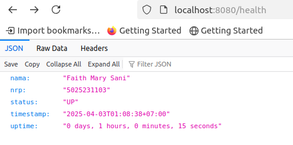
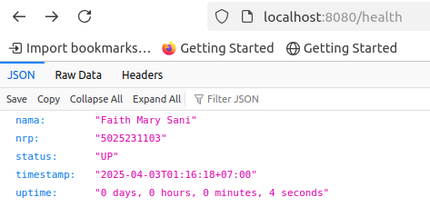
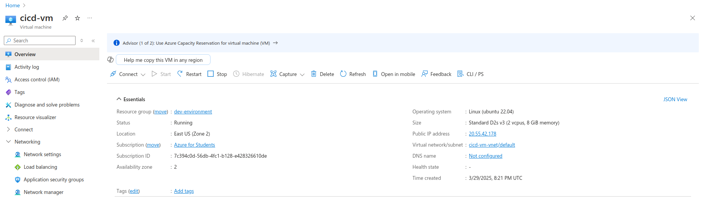
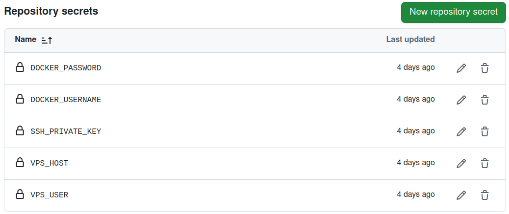
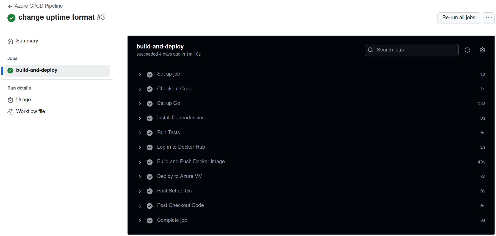
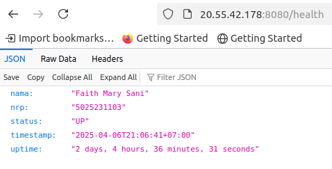

# Laporan Modul 1 NETICS

Nama: Faith Mary Sani

NRP: 5025231103

## Deskripsi Tugas

- Mengimplementasikan CI/CD untuk deploy API dengan endpoint /health dalam bentuk container Docker Multistage pada public VPS secara otomatis.

## Tahap Pengerjaan

- Membuat API menggunakan Golang.
- Membuat [Dockerfile](https://github.com/faithmry/health-api-ci-cd/blob/main/Dockerfile).
- Mencari dan mengakses public VPS.
- Menyusun [ci-cd.yml](https://github.com/faithmry/health-api-ci-cd/blob/main/.github/workflows/ci-cd.yml).

## API Golang

- Menampilkan nama, NRP, status, timestamp, dan uptime.
- uptime menggunakan format days, hours, minutes, seconds.

```go
r.GET("/health", func(c *gin.Context) {
    uptime := time.Since(startTime)

    days := int(uptime.Hours()) / 24
    hours := int(uptime.Hours()) % 24
    minutes := int(uptime.Minutes()) % 60
    seconds := int(uptime.Seconds()) % 60

    formattedUptime := fmt.Sprintf("%d days, %d hours, %d minutes, %d seconds", days, hours, minutes, seconds)
    currentTime := time.Now().In(location)

    c.JSON(200, gin.H{
        "nama":      "Faith Mary Sani",
        "nrp":       "5025231103",
        "status":    "UP",
        "timestamp": currentTime.Format(time.RFC3339),
        "uptime":    formattedUptime,
    })
})
```

- Dijalankan pada port 8080 dengan endpoint /health.

```go
r.Run(":8080")
```

**Testing:**

```bash
go run main.go
```

**Screenshot:**



## Docker Image

- Membuat container dengan Docker Multistage.

```dockerfile
FROM golang:1.24-alpine AS build

WORKDIR /app

COPY go.mod go.sum ./
RUN go mod download

COPY . .

RUN go build -o /health-api

FROM alpine:latest

# Install timezone data
RUN apk add --no-cache tzdata

WORKDIR /root/

COPY --from=build /health-api .

# Set the timezone
ENV TZ=Asia/Jakarta

EXPOSE 8080

CMD ["./health-api"]

```

- Set timezone sehingga waktu pada image tersebut sesuai.

**Testing:**

```bash
docker build -t faithmry/health-api:latest .
docker run -p 8080:8080 faithmry/health-api:latest
```

**Screenshot:**



## Public VPS

- Menggunakan Microsoft Azure.
- Membuat linux Virtual Machine.
- SSH ke Virtual Machine tersebut.

**Screenshot:**



## CI/CD

- Menyusun CI/CD untuk Set Up Go, Build and Push Docker Image, dan Deploy to Azure VM.

```yml
jobs:
  build-and-deploy:
    runs-on: ubuntu-latest

    steps:
      - name: Checkout Code
        uses: actions/checkout@v4

      - name: Set up Go
        uses: actions/setup-go@v4
        with:
          go-version: 1.24

      - name: Install Dependencies
        run: go mod tidy

      - name: Run Tests
        run: go test ./...

      - name: Log in to Docker Hub
        run: echo "${{ secrets.DOCKER_PASSWORD }}" | docker login -u "${{ secrets.DOCKER_USERNAME }}" --password-stdin

      - name: Build and Push Docker Image
        run: |
          docker build -t ${{ secrets.DOCKER_USERNAME }}/health-api:latest .
          docker push ${{ secrets.DOCKER_USERNAME }}/health-api:latest

      - name: Deploy to Azure VM
        uses: appleboy/ssh-action@master
        with:
          host: ${{ secrets.VPS_HOST }}
          username: ${{ secrets.VPS_USER }}
          key: ${{ secrets.SSH_PRIVATE_KEY }}
          script: |
            docker stop health-api || true
            docker rm health-api || true
            docker pull ${{ secrets.DOCKER_USERNAME }}/health-api:latest
            docker run -d --name health-api -p 8080:8080 --restart unless-stopped ${{ secrets.DOCKER_USERNAME }}/health-api:latest
            docker image prune -f
```

- Membuat Secrets pada Github, untuk `SSH_PRIVATE_KEY`, dsb.
- Setelah dipush ke Github, Github Actions akan langsung menjalankan CI/CD tersebut dan public API dapat langsung diakses setelah workflow selesai dijalankan.

**Screenshot:**

**_Github Secrets_**

**_Github Actions_**


## Link API

http://20.55.42.178:8080/health

**Screenshot:**



## Link Docker Image

https://hub.docker.com/repository/docker/faithmry/health-api/general
